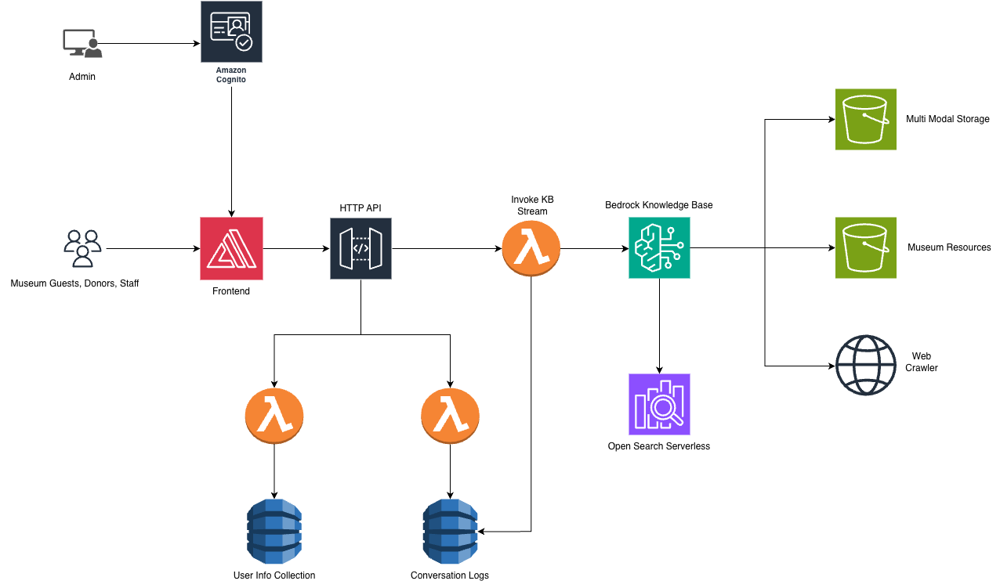

# [INSERT_PROJECT_NAME]

[INSERT_PROJECT_DESCRIPTION - 2-3 sentences describing what the project does, who it's for, and the key problem it solves]

---

## Visual Demo


> **[PLACEHOLDER]** Please provide a GIF or screenshot of the application interface and save it as `docs/media/user-interface.gif`

---

## Table of Contents

| Index                                               | Description                                              |
| :-------------------------------------------------- | :------------------------------------------------------- |
| [High Level Architecture](#high-level-architecture) | High level overview illustrating component interactions  |
| [Deployment Guide](#deployment-guide)               | How to deploy the project                                |
| [User Guide](#user-guide)                           | End-user instructions and walkthrough                    |
| [API Documentation](#api-documentation)             | Documentation on the APIs the project uses               |
| [Directories](#directories)                         | General project directory structure                      |
| [Modification Guide](#modification-guide)           | Guide for developers extending the project               |
| [Credits](#credits)                                 | Contributors and acknowledgments                         |
| [License](#license)                                 | License information                                      |

---

## High Level Architecture

[INSERT_ARCHITECTURE_OVERVIEW - Brief paragraph explaining the architecture, how components interact, and the overall system design]



> **[PLACEHOLDER]** Please create and provide an architecture diagram showing:
> - All major components/services
> - Data flow between components
> - User interaction points
> - External services/APIs
> 
> Save the diagram as `docs/media/architecture.png` (or .jpeg/.jpg)

For a detailed explanation of the architecture, see the [Architecture Deep Dive](./docs/architectureDeepDive.md).

---

## Deployment Guide

For complete deployment instructions, see the [Deployment Guide](./docs/deploymentGuide.md).

**Quick Start:**
1. [INSERT_QUICK_START_STEP_1]
2. [INSERT_QUICK_START_STEP_2]
3. [INSERT_QUICK_START_STEP_3]

---

## User Guide

For detailed usage instructions with screenshots, see the [User Guide](./docs/userGuide.md).

---

## API Documentation

For complete API reference, see the [API Documentation](./docs/APIDoc.md).

---

## Modification Guide

For developers looking to extend or modify this project, see the [Modification Guide](./docs/modificationGuide.md).

---

## Directories

```
├── backend/
│   ├── bin/
│   │   └── backend.ts
│   ├── lambda/
│   │   └── [INSERT_LAMBDA_FUNCTIONS]
│   ├── lib/
│   │   └── backend-stack.ts
│   ├── agent/
│   │   └── [INSERT_AGENT_FILES]
│   ├── cdk.json
│   ├── package.json
│   └── tsconfig.json
├── frontend/
│   ├── app/
│   │   ├── layout.tsx
│   │   ├── page.tsx
│   │   └── globals.css
│   ├── public/
│   └── package.json
├── docs/
│   ├── architectureDeepDive.md
│   ├── deploymentGuide.md
│   ├── userGuide.md
│   ├── APIDoc.md
│   ├── modificationGuide.md
│   └── media/
│       ├── architecture.png
│       └── user-interface.gif
├── LICENSE
└── README.md
```

### Directory Explanations:

1. **backend/** - Contains all backend infrastructure and serverless functions
   - `bin/` - CDK app entry point
   - `lambda/` - AWS Lambda function handlers
   - `lib/` - CDK stack definitions
   - `agent/` - [INSERT_AGENT_DESCRIPTION]

2. **frontend/** - Next.js frontend application
   - `app/` - Next.js App Router pages and layouts
   - `public/` - Static assets

3. **docs/** - Project documentation
   - `media/` - Images, diagrams, and GIFs for documentation

---

## Credits

This application was developed by:

- <a href="[INSERT_LINKEDIN_URL]" target="_blank">[INSERT_CONTRIBUTOR_NAME_1]</a>
- <a href="[INSERT_LINKEDIN_URL]" target="_blank">[INSERT_CONTRIBUTOR_NAME_2]</a>
- <a href="[INSERT_LINKEDIN_URL]" target="_blank">[INSERT_CONTRIBUTOR_NAME_3]</a>

[INSERT_ADDITIONAL_ACKNOWLEDGMENTS - Teams, supporters, or organizations to acknowledge]

---

## License

This project is licensed under the MIT License - see the [LICENSE](./LICENSE) file for details.

