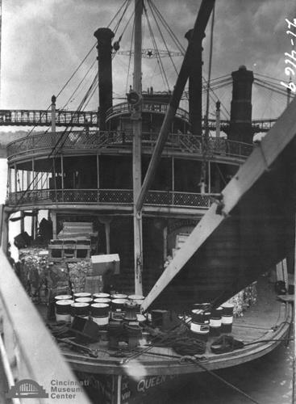

# Queen City steamboat

## Cincinnati Museum Center - Photograph Collection

### Summary Information

| Field | Value |
|-------|-------|
| **Title** | Queen City steamboat |
| **Image ID** | SC#21-4169 |
| **Collection** | Paul Briol Collection |
| **Date** | circa 1940 |
| **Dimensions** | 8 x 10 |
| **Media Type** | Photograph |
| **Format** | Photo print |

### Description

View of Queen City steamboat.

### Subjects

Queen City (Steamboat)

### Rights & Permissions

All rights reserved. Contact the CMC photo curator for copies or permission.

---
*Source: Cincinnati Museum Center Online Collection*
*Image ID: SC#21-4169*
