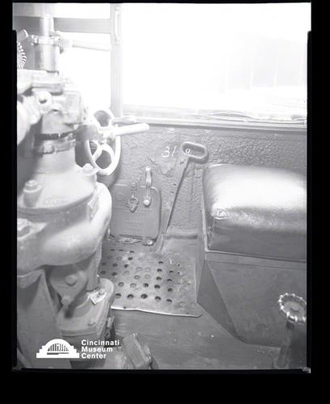

# New York Central Railroad Engine #3148

## Cincinnati Museum Center - Photograph Collection

### Summary Information

| Field | Value |
|-------|-------|
| **Title** | New York Central Railroad Engine #3148 |
| **Image ID** | SC#296-4145B |
| **Collection** | Rombach & Groene Collection |
| **Date** | 09/02/1954 |
| **Dimensions** | 8 x 10 |
| **Media Type** | Photograph |
| **Format** | Film negative |

### Description

Camera in cab of Engine No. 3148 at the Cincinnati Union Terminal showing slubge blow off cock open

### Subjects

Engines -- Ohio -- Cincinnati

### Rights & Permissions

All rights reserved. Contact the CMC photo curator for copies or permission.

---
*Source: Cincinnati Museum Center Online Collection*
*Image ID: SC#296-4145B*
