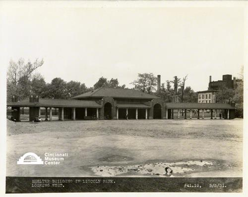

# Shelter Building in Lincoln Park

## Cincinnati Museum Center - Photograph Collection

### Summary Information

| Field | Value |
|-------|-------|
| **Title** | Shelter Building in Lincoln Park |
| **Image ID** | SC#319-028 |
| **Collection** | CUT Progress Photographs Collection |
| **Date** | 05/05/1931 |
| **Dimensions** | 8 x 10 |
| **Media Type** | Photograph |
| **Format** | Photo print |

### Description

#41.19  Shelter building in Lincoln Park looking West

### Subjects

Parks -- Ohio -- Cincinnati

### Rights & Permissions

All rights reserved. Contact the CMC photo curator for copies or permission.

---
*Source: Cincinnati Museum Center Online Collection*
*Image ID: SC#319-028*
