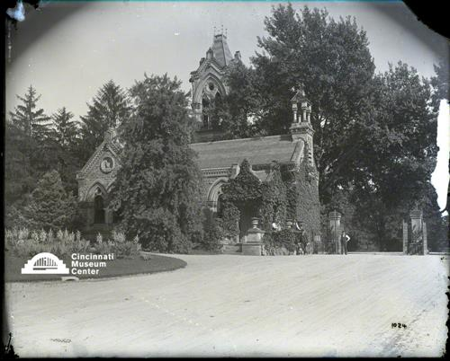

# Spring Grove Cemetery Entrance, 4521 Spring Grove Avenue

## Cincinnati Museum Center - Photograph Collection

### Summary Information

| Field | Value |
|-------|-------|
| **Title** | Spring Grove Cemetery Entrance, 4521 Spring Grove Avenue |
| **Image ID** | SC#296-1024 |
| **Collection** | Rombach & Groene Collection |
| **Date** | 1900-1910 |
| **Dimensions** | 8 x 10 |
| **Media Type** | Photograph |
| **Format** | Glass negative |

### Description

Spring Grove Cemetery, 4521 Spring Grove Avenue, was dedicated in 1845. The main gateway is flanked by office buildings erected between 1853 and 1867. They are designed in a Norman Gothic style planned by the Cincinnati architect James K. Wilson. The picture is of the entrance from inside the gates.

### Subjects

Cemeteries -- Ohio -- Cincinnati

### Rights & Permissions

All rights reserved. Contact the CMC photo curator for copies or permission.

---
*Source: Cincinnati Museum Center Online Collection*
*Image ID: SC#296-1024*
