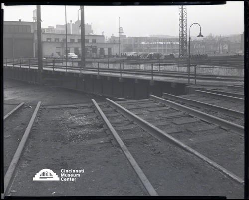

# Turntable, Cincinnati Union Terminal Yards

## Cincinnati Museum Center - Photograph Collection

### Summary Information

| Field | Value |
|-------|-------|
| **Title** | Turntable, Cincinnati Union Terminal Yards |
| **Image ID** | SC#296-4133G |
| **Collection** | Rombach & Groene Collection |
| **Date** | 12/24/1948 |
| **Dimensions** | 8 x 10 |
| **Media Type** | Photograph |
| **Format** | Film negative |

### Description

View looking north-east, showing the turntable at the Cincinnati Union Terminal Yards. This yard served seven major railroads with 16 tracks and could accomodate 17,000 travelers and 216 trains daily.

### Subjects

Cincinnati Union Terminal (Cincinnati, Ohio)

### Rights & Permissions

All rights reserved. Contact the CMC photo curator for copies or permission.

---
*Source: Cincinnati Museum Center Online Collection*
*Image ID: SC#296-4133G*
