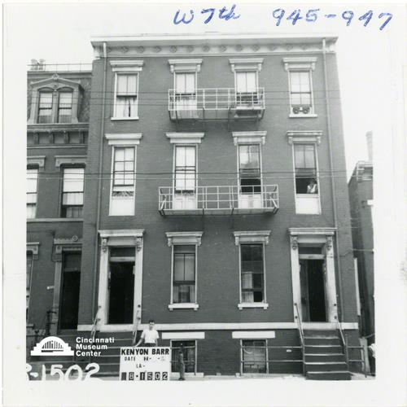

# 945-947 W. 7th Street

## Cincinnati Museum Center - Photograph Collection

### Summary Information

| Field | Value |
|-------|-------|
| **Title** | 945-947 W. 7th Street |
| **Image ID** | SC#115-2437 |
| **Collection** | Kenyon Barr Collection |
| **Date** | 07/01/1959 |
| **Dimensions** | 3.5 x 3.5 |
| **Media Type** | Photograph |
| **Format** | Photo print |

### Description

Structure at 945-947 West Seventh Street. Kenyon Barr project # 8-1502

### Subjects

Housing -- Ohio -- Cincinnati

### Rights & Permissions

All rights reserved. Contact the CMC photo curator for copies or permission.

---
*Source: Cincinnati Museum Center Online Collection*
*Image ID: SC#115-2437*
