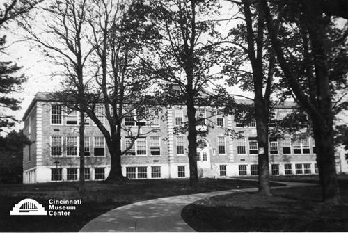

# Mt. Healthy High School

## Cincinnati Museum Center - Photograph Collection

### Summary Information

| Field | Value |
|-------|-------|
| **Title** | Mt. Healthy High School |
| **Image ID** | SC#150-388 |
| **Collection** | Samuel Hannaford & Sons Collection |
| **Date** | c. 1930 |
| **Dimensions** | 8 x 10 |
| **Media Type** | Photograph |
| **Format** | Photo print |

### Description

Photograph of Mt. Healthy high school designed by Samuel Hannaford & Sons, architects.

### Subjects

Architecture -- Ohio -- Mt. Healthy

### Rights & Permissions

All rights reserved. Contact the CMC photo curator for copies or permission.

---
*Source: Cincinnati Museum Center Online Collection*
*Image ID: SC#150-388*
