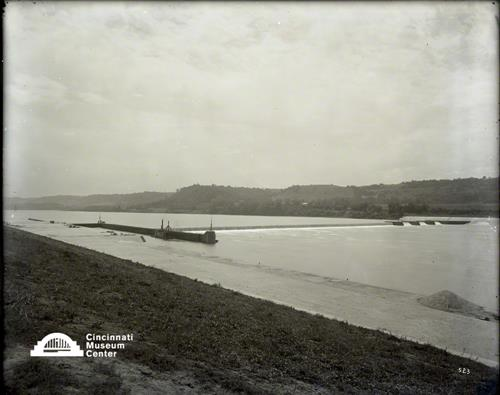

# Fernbank Dam

## Cincinnati Museum Center - Photograph Collection

### Summary Information

| Field | Value |
|-------|-------|
| **Title** | Fernbank Dam |
| **Image ID** | SC#296-523 |
| **Collection** | Rombach & Groene Collection |
| **Date** | 08/29/1913 |
| **Dimensions** | 8 x 10 |
| **Media Type** | Photograph |
| **Format** | Glass negative |

### Description

Construction of the Fernbank Dam began in 1905 and was completed in 1911.

### Subjects

Dams -- Ohio -- Cincinnati

### Rights & Permissions

All rights reserved. Contact the CMC photo curator for copies or permission.

---
*Source: Cincinnati Museum Center Online Collection*
*Image ID: SC#296-523*
