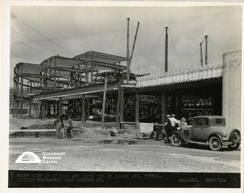

# South wing of station

## Cincinnati Museum Center - Photograph Collection

### Summary Information

| Field | Value |
|-------|-------|
| **Title** | South wing of station |
| **Image ID** | SC#319-141 |
| **Collection** | CUT Progress Photographs Collection |
| **Date** | 08/27/1931 |
| **Dimensions** | 8 x 10 |
| **Media Type** | Photograph |
| **Format** | Photo print |

### Description

#41.119  South wing of station and south end of Dalton Avenue tunnel. Looking north-west from Hopkins Street.

### Subjects

Cincinnati Union Terminal (Cincinnati, Ohio)

### Rights & Permissions

All rights reserved. Contact the CMC photo curator for copies or permission.

---
*Source: Cincinnati Museum Center Online Collection*
*Image ID: SC#319-141*
